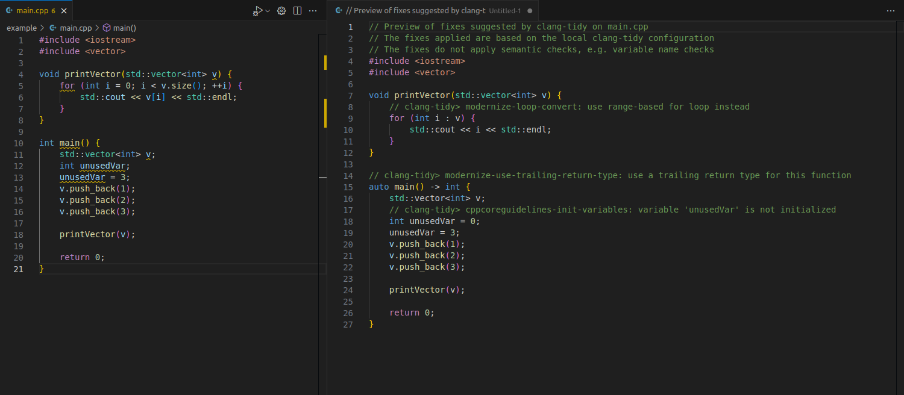
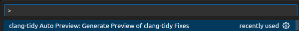

# clang-tidy Auto Preview

This extension allows you to view the suggested code fixes generated by clang-tidy for C++ code without modifying the original source file. 

The extension will use the local check configuration for `clang-tidy`, and auto-generate a file with the `clang-tidy` fixes applied displayed on a new split screen.



Comments will be added for each modification made to the source file, with information on what check was flagged, and a message for the reason for the modification.

**NOTE:** `clang-tidy` may highlight semantic issues, but will not suggest a fix, as any changes should be implemented by the developer. For example, if a variable `v` is used, this may get flagged (depending on enabled checks) as too short, and therefore potentially harder to decipher what it actually does. `clang-tidy` may highlight the flag, but will not generate a fix, as the choice of new name is left to the developer. **If a fix is not suggested by `clang-tidy`, it will not be applied in the modified preview.**

## Dependencies

This extension will require `clang-tidy` installed. 

`clang-tidy` is a tool developed by the CLANG compiler team for linting C++ source files for coding best practices. `clang-tidy` has VSCode integration, but the extension instead uses `clang-tidy` directly for its output. The `clang-tidy` checks can be customized using a `.clang-tidy` config file. View the CLANG documentation for specifics on what the various checks do. 

In addition, `npm` and `vsce` will need to be installed for building, as well as **locally** installed `js-yaml` for parsing the YAML generated by `clang-tidy` (I couldn't get it to build without it installed locally, despite installing `@types/js-yaml`, so YMMV).

## Build

Build and install the extension using the commands:

```bash
npm install
vsce package
code --install-extension clang-tidy-fix-preview-1.0.0.vsix
```

## Use

With the `*.cpp` file active in the editor, use the command "clang-tidy Auto Preview: Generate Preview of clang-tidy Fixes":

